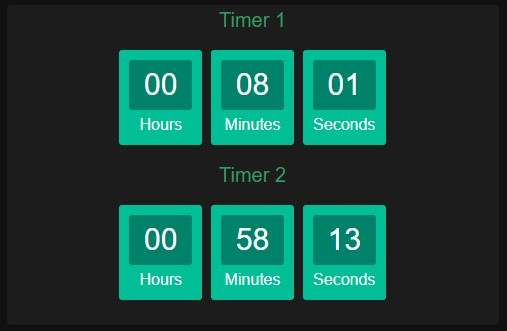

# googe-assistant-timer-card

Shows current timers set on google home devices

Note: i cant get it to update every second - it updates at random, but acceptable intervals imo.

Note2: If no timer is set, the card will be very thin as to not disturb your layout.

Before you install this:
Download and setup [Google Home Integration](https://github.com/leikoilja/ha-google-home#sensors)
You can find it in the default HACS repo. Just search Google Home.
Once installed, click on "configure" and change update interval to 30 seconds

[HACS](https://hacs.xyz/) Install:

    To install this:
    -> goto HACS(tab) 
    -> click Frontend 
    -> click 3 dots in the right corner 
    -> click custom repositories
    -> paste 'CasperJohansen/googe-assistant-timer-card' into 'repository' field
    -> select category and choose Lovelace
    -> add repository
    -> click '+ Explore & Download Repositories'
    -> search for 'Google Assistant Timer Card'
    -> Download it

    To use this:
    -> add manual card
    -> paste:
        type: custom:ga-timer-card
        entity: sensor.*YOUR GOOGLE DEVICE*_timers
    -> enjoy ;)
